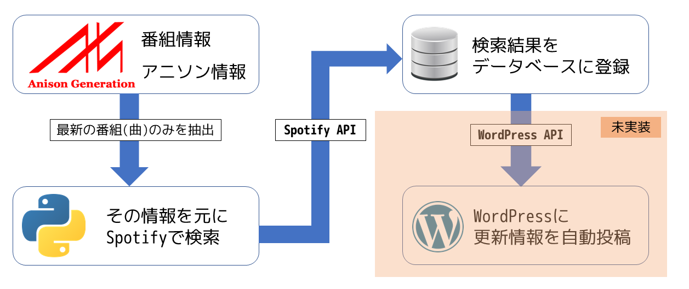

# 最新アニソン配信取得
## 概要
Spotifyの最新のアニソンを配信を監視します．

## 機能
アニメタイトルとそれに対するOP，ED曲を自動取得します
抽出結果をSlackに通知します

## 必要モジュール
- spotipy (Spotify API)
- ezslack (同梱,Slack通知用)

## 動作

アニソンデータベースであるAnison Generations様より提供されているCSVより最新のアニメタイトルおよびそのOP・ED曲を抽出し，Spotifyで検索をかけます．取得できた情報をデータベースに登録します．